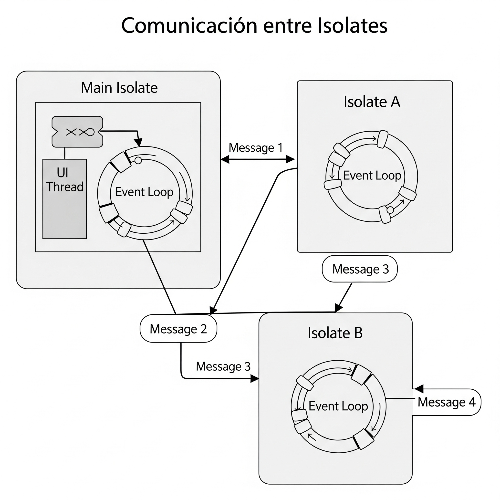

## Capítulo 1: Isolates - El Poder de Procesar en Segundo Plano sin Bloquear tu UI

Imagina tu aplicación Flutter como una pequeña orquesta sinfónica. Cada músico (el código) tiene una tarea que realizar para que la melodía (tu UI) suene armoniosa y fluida. Por defecto, en Flutter, toda esta orquesta (todo tu código Dart) se ejecuta en un solo escenario: el **Isolate Principal** (o *main isolate*).

Piensa en este Isolate Principal como el director de la orquesta y el músico más importante a la vez. Es el encargado de todo: de procesar las acciones del usuario (un tap en la pantalla), de ejecutar la lógica de tu aplicación, y de, crucialmente, dibujar cada fotograma de la interfaz de usuario (UI) en la pantalla. Todo lo que sucede en tu app pasa por este único director-músico.

La mayoría de las veces, esta orquesta solista funciona de maravilla. Flutter es tan rápido que el director es capaz de gestionar todas las tareas sin que notes ninguna pausa. Tu aplicación se siente fluida y responde al instante.

Pero, ¿qué sucede si de repente el director de la orquesta tiene que tocar dos sinfonías famosas **al mismo tiempo**? Imagina que debe ejecutar la intensidad dramática de la **Quinta Sinfonía de Beethoven** y la elegancia melancólica de la **Cuarenta Sinfonía de Mozart** simultáneamente. Es imposible para un solo director y una sola orquesta.

Si tu aplicación necesita procesar una cantidad gigantesca de datos (como analizar un archivo JSON enorme), realizar cálculos matemáticos complejos que tardan varios segundos, o comprimir una imagen o video muy pesado a la par que gestiona la UI se hace muy difícil.

Mientras el director está concentrado en esa enorme tarea, no puede hacer ninguna otra cosa. La música (tu UI) se detiene, se traba o, peor aún, la aplicación deja de responder. A esto lo llamamos **"UI Jank"** (o "saltos" en la interfaz), esa sensación molesta de que la aplicación "se congela".

### Presentamos a los "Isolates": Tus Músicos de Apoyo

Aquí es donde entran en juego los **Isolates**. Puedes imaginarlos como escenarios adicionales con sus propios directores y músicos individuales. Cuando tienes una tarea excepcionalmente pesada que no quieres que interrumpa la melodía principal (la UI), puedes enviarla a uno de estos escenarios secundarios, a un "**Isolate de Ayuda**". Es como si le dieras la Quinta Sinfonía de Beethoven a una orquesta, y la Cuarenta de Mozart a otra diferente. Cada orquesta puede ensayar y tocar su sinfonía al mismo tiempo, sin afectar a la otra.

La clave es la palabra "aislados":

* **Memoria Propia:** Cada Isolate tiene su **propia memoria privada**. No comparten variables, objetos o estados directamente. Esto es una diferencia fundamental con los "hilos" tradicionales de otros lenguajes, donde compartir memoria puede llevar a problemas complejos de sincronización y errores difíciles de depurar.
* **Comunicación por Mensajes:** Si un Isolate de Ayuda necesita decirle algo al Isolate Principal (o viceversa), lo hace **enviando mensajes**. Es como si los directores de los diferentes escenarios se enviaran notas por debajo de la puerta: "¡Ya terminé la partitura!", "¡Aquí tienes los resultados!". Esto garantiza que no haya conflictos por el acceso a datos compartidos.

Al mover una computación pesada a un Isolate de Ayuda, permites que:

* El Isolate Principal (tu director original) siga dibujando la UI y respondiendo a los toques del usuario sin interrupciones.
* El Isolate de Ayuda (tu director secundario) procese la tarea pesada al mismo tiempo y de forma independiente.

Esto es especialmente beneficioso en dispositivos modernos con múltiples núcleos de procesamiento. Los Isolates aprovechan esos núcleos, permitiendo que tu aplicación haga varias cosas a la vez, tomando ventaja del verdadero procesamiento concurrente.

### El Event Loop: El Corazón de Cada Isolate

Cada Isolate, ya sea el principal o uno de ayuda, tiene su propio **"Event Loop"** (Bucle de Eventos). Piensa en el Event Loop como una lista de tareas pendientes que cada director tiene en su atril. Cuando una tarea (un "evento") llega, se añade al final de la lista. El director procesa estas tareas una por una, en el orden en que llegaron.

En el Isolate Principal, estos eventos pueden ser muy variados:

* Un usuario toca un botón.
* Se completa una petición a una API.
* Una función debe ejecutarse.
* Es hora de dibujar el siguiente fotograma en la pantalla.

---



La imagen que acabas de ver, titulada **"Comunicación entre Isolates"**, ilustra de manera concisa cómo los diferentes Isolates en una aplicación Dart (y por ende, Flutter) se comunican entre sí. Vamos a desglosarla:

**1. El Isolate Principal (`Main Isolate`):**
* Es el recuadro grande a la izquierda. Como ya hemos hablado, este es el "director de orquesta" de tu aplicación.
* Dentro del `Main Isolate`, puedes ver dos componentes clave:
    * **`UI Thread` (Hilo de UI):** Representa la parte del Isolate principal que se encarga de dibujar tu interfaz de usuario y de responder a las interacciones del usuario. Si este hilo se bloquea, tu app se "congelará".
    * **`Event Loop` (Bucle de Eventos):** Esta es la maquinaria que procesa todas las tareas del `Main Isolate`. Constantemente está revisando una cola de eventos (como el toque del usuario, una actualización de datos, o una instrucción para dibujar) y las ejecuta una por una. Las flechas circulares dentro del Event Loop indican este ciclo continuo de procesamiento.

**2. Los Isolates de Ayuda (`Isolate A` e `Isolate B`):**
* Son los recuadros más pequeños a la derecha. Estos representan los "escenarios adicionales" o "músicos de apoyo" que creamos para realizar tareas pesadas.
* Es fundamental notar que cada `Isolate A` e `Isolate B` también tienen su **propio `Event Loop`**. Esto refuerza la idea de que son completamente independientes del `Main Isolate`; tienen su propio hilo de ejecución y su propia memoria. Esto significa que, si el `Event Loop` de `Isolate A` está ocupado con una tarea compleja, no afectará al `Main Isolate` ni al `Isolate B`.

**3. La Comunicación por Mensajes (`Message 1`, `Message 2`, `Message 3`, `Message 4`):**
* Esta es la parte más importante del diagrama. Las flechas etiquetadas como `Message 1`, `Message 2`, `Message 3`, `Message 4` representan la **única forma en que los Isolates pueden comunicarse entre sí: a través del envío de mensajes**.
* **`Message 1` (Main Isolate -> Isolate A):** El `Main Isolate` envía una tarea o datos a `Isolate A` para que los procese. Por ejemplo, podría enviarle un JSON muy grande para que lo parseé.
* **`Message 2` (Isolate A -> Main Isolate):** Una vez que `Isolate A` ha terminado su tarea, envía un mensaje de vuelta al `Main Isolate` con el resultado. Por ejemplo, el JSON ya parseado.
* **`Message 3` (Main Isolate -> Isolate B):** De manera similar, el `Main Isolate` puede delegar otra tarea a `Isolate B`.
* **`Message 4` (Isolate B -> Main Isolate):** Y `Isolate B` responderá con sus resultados una vez que finalice.

**Conceptos clave que la imagen ilustra:**

* **Aislamiento:** La separación visual de los recuadros (`Main Isolate`, `Isolate A`, `Isolate B`) y la presencia de Event Loops individuales en cada uno, subraya la idea de que tienen memoria aislada y no comparten estado directamente.
* **Concurrencia:** La posibilidad de que el `Main Isolate` siga trabajando en la UI mientras `Isolate A` e `Isolate B` procesan sus tareas de forma paralela.
* **Comunicación Segura:** La necesidad de enviar mensajes explícitos (flechas) para transferir información, evitando los problemas de sincronización y *race conditions* que ocurren al compartir memoria directamente entre hilos.

---

## Isolates en Acción: Demostración Práctica

Para que realmente comprendas el impacto de los Isolates, vamos a ver una demostración visual sencilla pero poderosa.

Imagina una aplicación Flutter muy simple que hace dos cosas al mismo tiempo:

1.  **Muestra un GIF animado** que se reproduce continuamente en la pantalla.
2.  **Realiza una tarea de cómputo pesado** (simularemos esto con un bucle que se ejecuta muchas veces, consumiendo CPU).

Vamos a ejecutar esta aplicación de dos maneras:

**Escenario 1: Todo en el Isolate Principal**

En este primer escenario, tanto la reproducción del GIF como la tarea de cómputo pesado se ejecutan directamente en el Isolate Principal. ¿Qué crees que sucederá?

**Visualización (Descripción para tu libro/curso y cómo debería verse en el ejemplo de código):**

* **Interfaz de Usuario:** Veremos un GIF animado reproduciéndose.
* **Código:** Tendremos una función que inicia el GIF y otra función que ejecuta el bucle de cómputo pesado. Ambas se llamarán o ejecutarán en el mismo hilo principal.
* **Resultado Esperado (¡El Punto Clave!):** Cuando la función de cómputo pesado comience a ejecutarse, notarás que **el GIF animado se detiene, se congela o se reproduce con saltos evidentes ("UI Jank")**. Esto sucede porque el Isolate Principal está completamente ocupado ejecutando el cálculo intensivo y no tiene tiempo para actualizar la UI y animar el GIF. La "orquesta" principal está tan concentrada en la partitura difícil que se olvida de tocar la melodía visible.

**El Código (Ejemplo Conceptual Simplificado en Dart):**

Aunque no es el código exacto de Flutter, la idea sería mostrar algo así:

````dart
// En el Isolate Principal

void iniciarGif() {
  // ... lógica para iniciar la animación del GIF
}

void realizarComputoPesado() {
  print("Comienza el cómputo pesado...");
  for (int i = 0; i < 1000000000; i++) {
    // Simulación de tarea pesada
  }
  print("El cómputo pesado ha terminado.");
}

void main() {
  iniciarGif();
  realizarComputoPesado(); // ¡Esto bloqueará el UI!
}